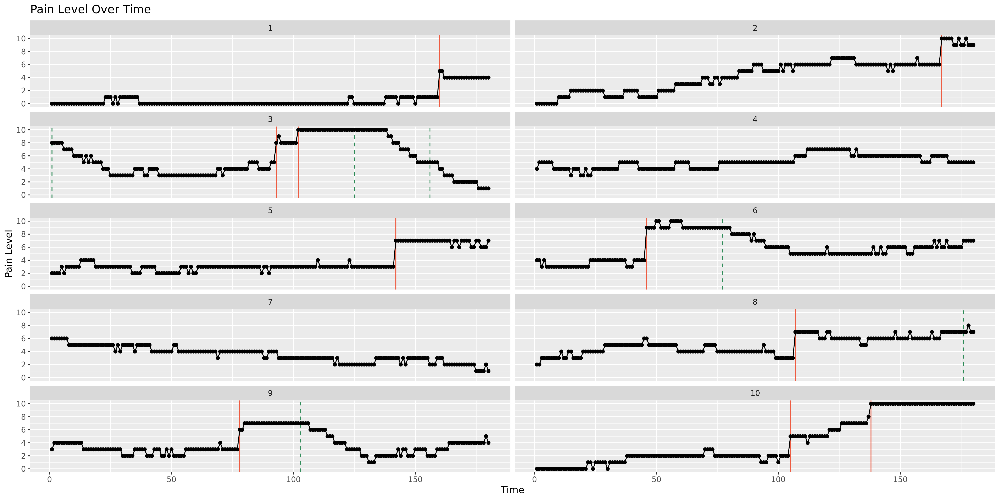

# Health Research from Home (HRfH)

Synthetic data for hackathon.

## Parameters

-   Ordinal scale from 0–10
-   Assume it is ‘pain’ but could be any symptom ot outcome (label it
    ‘pain’ for now)
-   Follow-up for 6 months
-   Assume in first iteration that people report every day
-   Groups of people
    -   High disease severity
    -   Moderate disease severity
    -   Low disease severity
    -   …where ‘severity’ means the average level of pain
-   But people will *transition* between these levels of disease
    activity
-   Assume that the transition probabilities are known
    -   Usually in response to treatment
    -   If high or medium severity, clinical treatment will want to get
        that under control
    -   Change in treatments 6 weeks to 3 months for ‘high’
    -   Then can have a rule that treatment pushes (e.g. 2/3 of) people
        from high to moderate/low state
-   Certain people are more likely to go back to high disease severity
-   **Treatment is modelled in the background but not recorded
    explicitly in the data**
-   Some patients more likely to respond to serial treatments, others
    not (see 2/3 above)

### Flares

-   If latent continuous variable increases by a certain amount in a
    certain window, then there is a high probability (not a guarantee)
    of recording an onset flare event – which is a discrete event.
-   Duration of flare event – how long does it last for?
-   Do they return to where they were at the end of the flare or is it a
    changepoint.
-   Some/all flares are not predictable in advance. So flares could be a
    point process that changes the latent trajectory, rather than the
    other way round.
-   But participants may try to approach the problem of trying to
    predict from the ‘pre-flare period’.
    -   So flare can induce sometimes but not always a pre-flare ramping
        up period. Either linear ramping up in latent variable.
    -   Or increase in variability/amplitude? Or both.
-   Flares are ~~self-exciting process~~ – patients continually have
    flares until they are treated. Or just the hazard rate of flare
    increases with latent state of disease activity.
-   Low disease activity: 4 or 5
-   Definition of a flare is 3 or more units, a sudden increase and
    sustained for a fixed minimum duration.
-   Challenge is not to find the flares but just not to miss them with
    their algorithm.
-   Model as a directed acyclic graph
-   Write up as a paper(?) or parametrizable simulator to provide
    e.g. MSc students access to data. With Shiny interface.
-   Shoei is looking after GitHub page with resources. So can share as
    web app or R package.

## Naïve simulation

``` r
simulate_patient <- function(days = 180) {
    set.seed(123)  # For reproducibility
    flare_days <- integer(0)  # Initialize vector to record flare days
    treatment_days <- integer(0)  # Initialize vector to record treatment days
    
    # Define states
    states <- c("low", "medium", "high")
    
    # Transition probabilities
    trans_probs <- matrix(c(
        0.8, 0.15, 0.05,  # low -> low, medium, high
        0.1, 0.8, 0.1,    # medium -> low, medium, high
        0.05, 0.15, 0.8   # high -> low, medium, high
    ), nrow = 3, byrow = TRUE)
    
    # Pain levels associated with each state
    pain_levels <- list(
        low = 0:3,
        medium = 4:7,
        high = 8:10
    )
    
    # Initialize state and pain
    current_state <- sample(states, 1, prob = c(0.4, 0.4, 0.2))
    pain <- numeric(days)
    state_history <- character(days)
    
    last_flare_day <- -21  # Initialize to a value more than 3 weeks before day 1
    last_treatment_day <- -21  # Initialize to a value more than 3 weeks before day 1
    
    for (day in 1:days) {
        # Record current state
        state_history[day] <- current_state
        
        # Simulate pain based on current state
        pain[day] <- sample(pain_levels[[current_state]], 1)
        
        # Randomly determine if a flare occurs, ensuring at least 3 weeks since last flare
        if (day - last_flare_day >= 21 && runif(1) < 0.05) {  # 5% chance of flare
            current_state <- "high"  # Flare pushes state to high
            flare_days <- c(flare_days, day)  # Record flare day
            last_flare_day <- day  # Update last flare day
        }
        
        # Randomly determine if treatment occurs, ensuring at least 3 weeks since last treatment
        if (day - last_treatment_day >= 21 && runif(1) < 0.1) {  # 10% chance of treatment
            if (current_state == "high") {
                current_state <- sample(c("medium", "low"), 1, prob = c(0.67, 0.33))  # Treatment pushes state to medium or low
            } else if (current_state == "medium") {
                current_state <- "low"  # Treatment pushes state to low
            }
            treatment_days <- c(treatment_days, day)  # Record treatment day
            last_treatment_day <- day  # Update last treatment day
        }
        
        # Transition to next state
        current_state <- sample(states, 1, prob = trans_probs[states == current_state, ])
    }
    
    return(list(pain = pain, states = state_history, flares = flare_days, treatments = treatment_days))
}

# Example usage
simulation_result <- simulate_patient()
pain_data <- simulation_result$pain
state_data <- simulation_result$states
```

``` r
# Convert state data to numeric for plotting
state_numeric <- as.numeric(factor(state_data, levels = c("low", "medium", "high")))

# Plotting
par(mfrow = c(2, 1))  # Set up the plotting area to have 2 rows and 1 column

# Define traffic light colors for states
state_colors <- c("low" = "#8bc34a", "medium" = "#ffeb3b", "high" = "#f44336")

# Plot pain data
plot(pain_data, type = "l", main = "Simulated Pain Reports", xlab = "Day", ylab = "Pain Level", col = "grey")
points(pain_data, col = state_colors[state_data], pch = 16)

# Add vertical lines for flares and treatments
# abline(v = simulation_result$flares, col = "red", lty = 2)  # Flares in blue dashed lines
# abline(v = simulation_result$treatments, col = "green", lty = 2)  # Treatments in red dashed lines

# Plot state data
plot(state_numeric, type = "p", main = "Latent States Over Time", xlab = "Day", ylab = "State", yaxt = "n",
    col = state_colors[state_data], pch = 16)
axis(2, at = 1:3, labels = c("low", "medium", "high"))

# Add vertical lines for flares and treatments
abline(v = simulation_result$flares, col = "red", lty = 2)  # Flares in blue dashed lines
abline(v = simulation_result$treatments, col = "green", lty = 2)  # Treatments in red dashed lines
```


## DAG


See
<https://cran.r-project.org/web/packages/simDAG/vignettes/v_sim_from_dag.html>
for more information.

## Revised simulation with treatments

-   Can we overlay treatments and show
-   Binary indicator of on treatment or not
-   Precondition for treatment: should be in medium or high pain state
    (not low)
-   If in high state, go onto treatment
    -   After 3 or 6 months, side-effects or non-effect of teatment
    -   Once formally non-responded, switch to another treatment
    -   Reset clock and roll the dice on treatment effectiveness + side
        effects (two separate things but both would cause change after
        3-6 months)
    -   Do people every come off treatment? If it works well, then no,
        not for the purpose of this exercise. So people in medium or
        high state have a high probability of being treated, and if it
        works, then high probability of going down to medium or low. And
        if so, then assuming no side effects, then just stay on it.
    -   Make treatment keep pain down for 1 month (not just
        instantaneous effect). Realistically 3-6 months but might not
        get captured in 6 month followup period. No need to assume
        anything like gradual treatment resistance. It either works or
        it doesn’t.
    -   Speed of response – wash in time. Some people respond rapidly,
        slowly or not at all. Do you respond in 2 weeks or in 3 months?

In clinical reality, when we have a new patient, we really can’t predict
what their trajectory will be, even if we know their age, sex or
ethnicity. So just assume phenotype, set at baseline, but not observable
or not directly correlated with observable baseline variables.

No need to connect genotype with treatment. Treatment effectiveness can
just be a roll of the dice.

See `simulator.R`.


